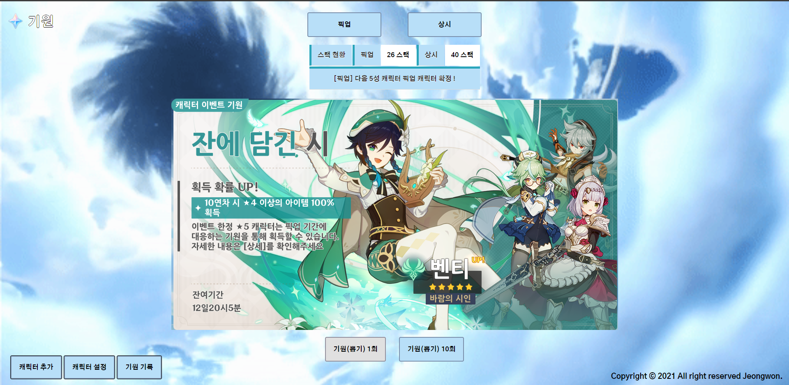
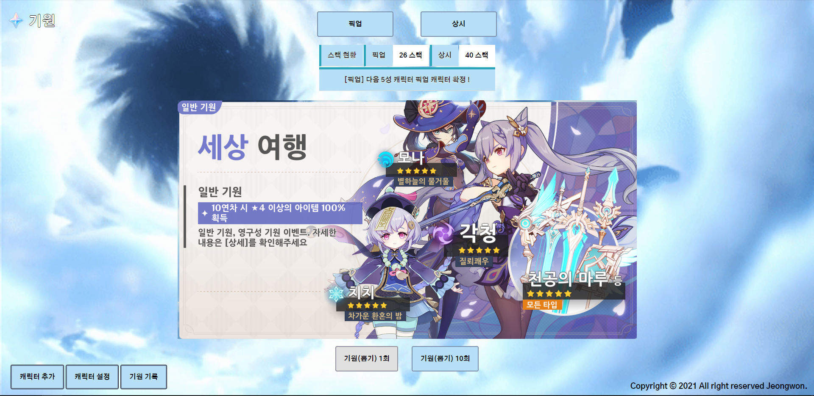
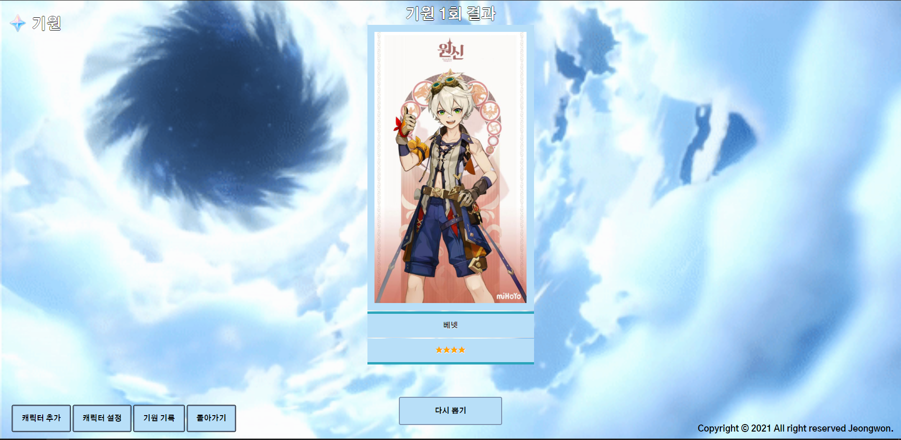
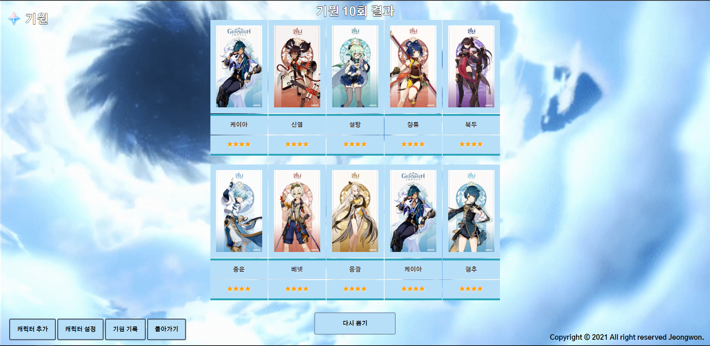
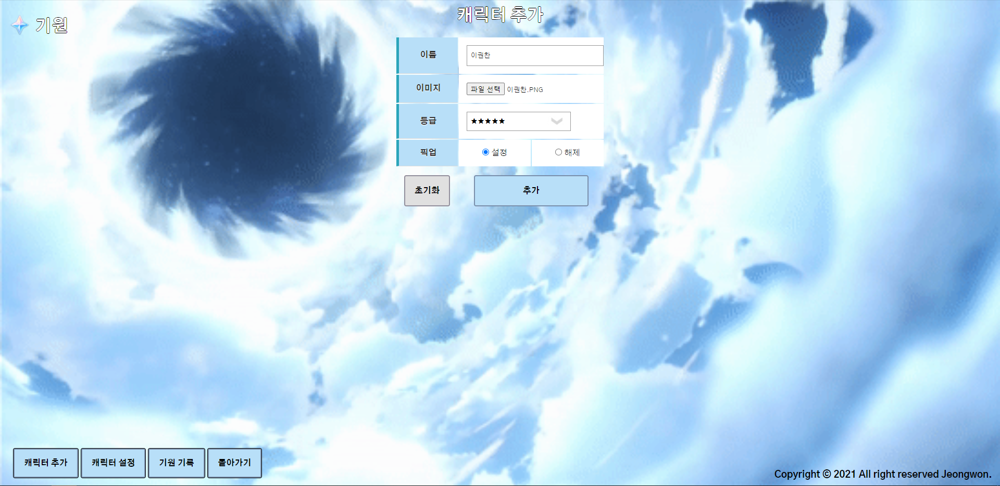
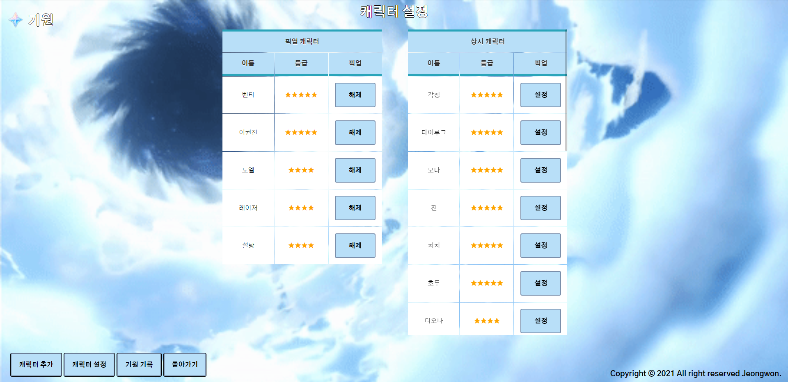
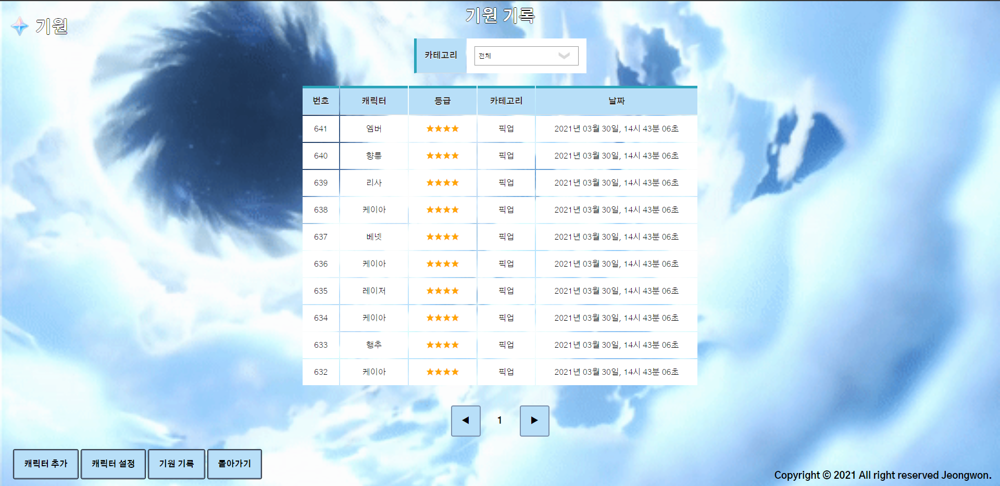

# **Wish Simulator**

## **목차**

1. [Wish Simulator란?](#Wish-Simulator란)
2. [스크린샷](#스크린샷)
3. [개발 정보](#개발-정보)

### **Wish Simulator란?**

-   게임 원신의 기원(뽑기, 가챠) 시뮬레이션을 할 수 있습니다.

### **스크린샷**

-   메인 화면 1
    
-   메인 화면 2
    
-   기원 중
    
-   기원 1회 결과
    
-   기원 10회 결과
    
-   캐릭터 추가
    
-   캐릭터 설정
    
-   기원 기록
    

### **개발 정보**

-   언어 - [Java](https://www.oracle.com/java/)
-   앱 프레임워크 - [JSP (JavaServer Pages)](https://www.oracle.com/java/technologies/jspt.html)
